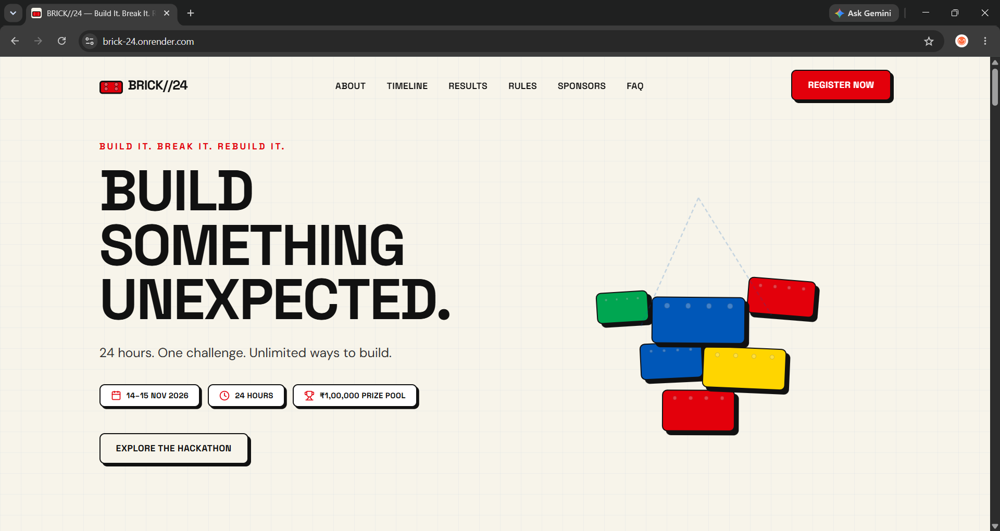
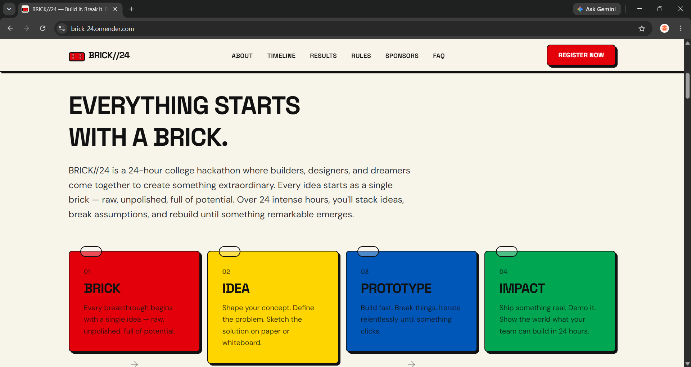
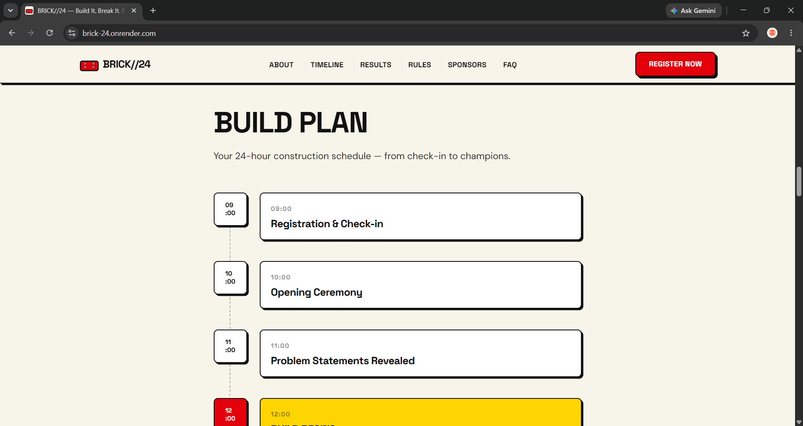
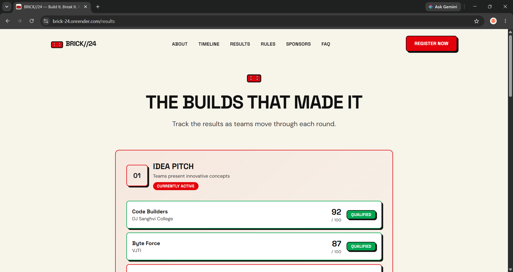
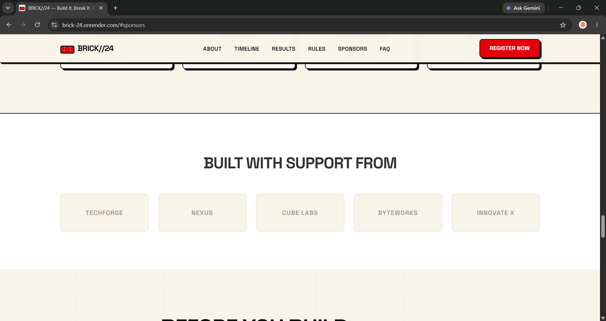
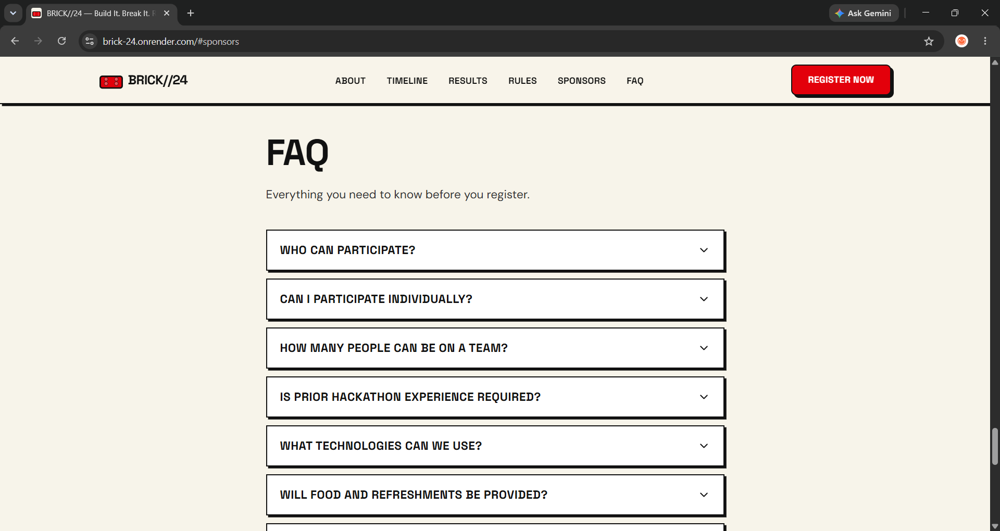
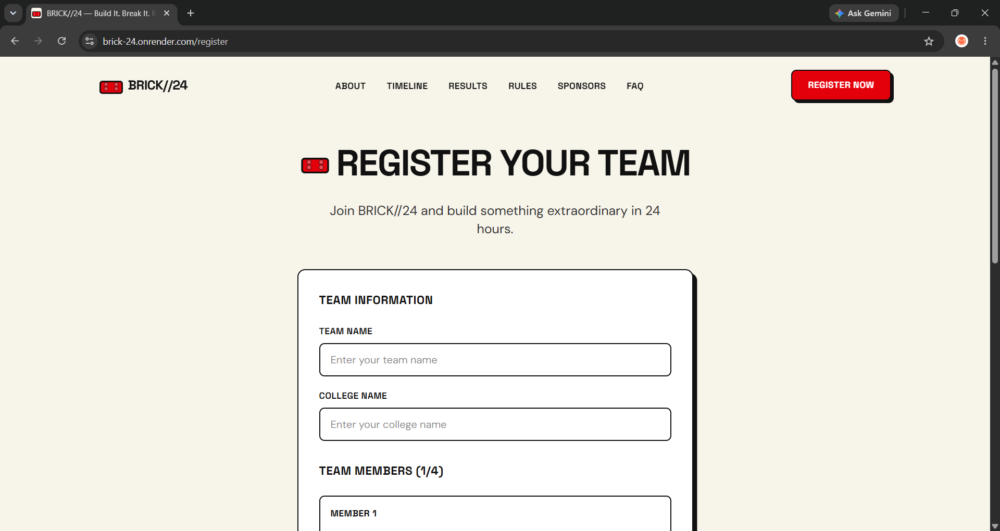
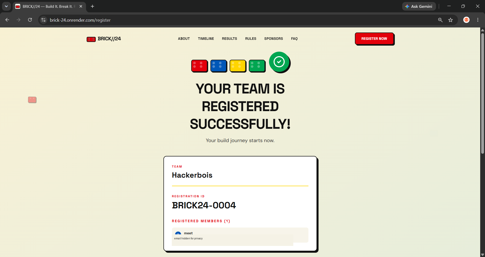

# 🧱 BRICK//24 — Hackathon Landing Page

> **Build It. Break It. Rebuild It.**

A LEGO-inspired landing page designed and developed for a fictional **24-hour college hackathon** called **BRICK//24**.

🌐 **Live Website:** https://brick-24.onrender.com  
💻 **GitHub Repository:** https://github.com/Meetparekh-07/Brick-24

---

# 📌 Project Overview

**BRICK//24** is a fictional 24-hour college hackathon concept created as the theme and visual identity for this landing page project.

The main objective of this project was to design and develop a **high-quality, interactive and responsive hackathon landing page** with a strong visual identity and a clear user journey.

The website is inspired by LEGO and the idea that every great project starts with a small **brick** — an idea that can be built, tested, broken, improved and rebuilt into something meaningful.

The concept is represented by the tagline:

> **BUILD IT. BREAK IT. REBUILD IT.**

The website follows a simple user journey:

```text
DISCOVER
    ↓
UNDERSTAND
    ↓
GET EXCITED
    ↓
REGISTER
```

The LEGO theme influences the complete visual language of the website, including:

- Colors
- Typography
- Cards
- Buttons
- Borders
- Shadows
- Animations
- Interactive elements
- Registration experience

The goal was to create a memorable hackathon landing page rather than a conventional template-based website.

---

# ✨ Features Implemented

## 🏠 Landing Page

- LEGO-inspired hero section
- BRICK//24 branding
- 24-hour hackathon information
- Prize pool section
- Registration CTA
- Interactive LEGO-inspired visual elements
- Responsive design

## 📖 About Section

- Introduction to BRICK//24
- Explanation of the hackathon concept
- LEGO-inspired storytelling
- Building journey:

```text
BRICK → IDEA → PROTOTYPE → IMPACT
```

## ⏱️ Timeline

- Complete 24-hour hackathon timeline
- Event stages
- Visual timeline cards
- LEGO-inspired styling

## 🏆 Results

- Dedicated Results page
- Round-wise results
- Team names
- College names
- Scores
- Qualification status
- Current round indication

## 📋 Rules & Eligibility

- Team eligibility information
- Team size requirements
- Participation rules
- Hackathon guidelines

## 🤝 Sponsors & Mentors

- Sponsor section
- Mentor section
- Supporting organization information

## ❓ FAQ

- Interactive FAQ section
- Accordion-based questions and answers
- Common participant questions

## 📝 Team Registration

The website includes a working registration flow where users can enter:

- Team name
- College name
- Team members
- Member names
- Member email addresses

The registration process includes:

- Form validation
- Email validation
- Team-size validation
- Duplicate team-name checking
- Registration ID generation
- Backend API integration
- JSON data storage

## 🎉 Registration Success Animation

After a valid registration, a LEGO-inspired animation is displayed:

```text
LEGO BRICKS
     ↓
BUILDING
     ↓
     ✓
     ↓
REGISTRATION SUCCESSFUL
     ↓
REGISTRATION ID
```

The success screen displays the registered team and generated registration ID.

## 📱 Responsive Design

The website is designed for:

- Desktop
- Laptop
- Tablet
- Mobile

## ♿ Accessibility

- Semantic HTML
- Responsive layouts
- Clear visual hierarchy
- Keyboard-friendly interactions
- Reduced-motion support

---

# 🛠️ Technologies and Libraries Used

## Frontend

| Technology | Purpose |
|---|---|
| **React** | Building reusable UI components |
| **TypeScript** | Type-safe frontend development |
| **Vite** | Development server and production build |
| **CSS** | Styling, responsive layouts and animations |

## Backend

| Technology | Purpose |
|---|---|
| **Node.js** | Backend runtime |
| **Express 5** | REST API and server |
| **CORS** | Cross-origin request handling |
| **Body Parser** | Processing JSON request data |

## Development & Deployment

| Tool | Purpose |
|---|---|
| **Git** | Version control |
| **GitHub** | Source code repository |
| **npm** | Package management |
| **VS Code** | Development environment |
| **Render** | Deployment |

## Storage

Registration data is stored in:

```text
server/registrations.json
```

The JSON file is used for the project demonstration and registration flow.

> For a real-world hackathon with permanent participant data, a persistent database would be recommended.

---

# ⚙️ Setup Instructions

## 1. Clone the Repository

```bash
git clone https://github.com/Meetparekh-07/Brick-24.git
```

## 2. Navigate to the Project

```bash
cd Brick-24
```

## 3. Install Dependencies

```bash
npm install
```

## 4. Start the Frontend

```bash
npm run dev
```

## 5. Start the Backend

Open another terminal and run:

```bash
npm run dev:server
```

## 6. Run Frontend and Backend Together

```bash
npm run dev:all
```

This starts both the Vite frontend and Express backend.

## 7. Create Production Build

```bash
npm run build
```

## 8. Start Production Server

```bash
npm start
```

The Express server serves the production frontend and backend API.

---

# 📂 Project Structure

```text
Brick-24/
│
├── public/
│   ├── favicon.svg
│   └── icons.svg
│
├── server/
│   ├── index.js
│   └── registrations.json
│
├── src/
│   │
│   ├── assets/
│   │
│   ├── components/
│   │   ├── ui/
│   │   │   ├── Accordion.tsx
│   │   │   ├── Brick.tsx
│   │   │   └── Button.tsx
│   │   │
│   │   ├── AboutSection.tsx
│   │   ├── ChallengeSection.tsx
│   │   ├── FAQ.tsx
│   │   ├── FinalCTA.tsx
│   │   ├── Footer.tsx
│   │   ├── Hero.tsx
│   │   ├── MentorsSection.tsx
│   │   ├── Navbar.tsx
│   │   ├── PrizeSection.tsx
│   │   ├── RegistrationBuildingAnimation.tsx
│   │   ├── RegistrationForm.tsx
│   │   ├── ResultCard.tsx
│   │   ├── RoundSection.tsx
│   │   ├── RulesSection.tsx
│   │   ├── SponsorsSection.tsx
│   │   ├── StatsSection.tsx
│   │   ├── StatusBadge.tsx
│   │   ├── SuccessScreen.tsx
│   │   └── Timeline.tsx
│   │
│   ├── data/
│   │
│   ├── hooks/
│   │
│   ├── pages/
│   │   ├── LandingPage.tsx
│   │   ├── RegisterPage.tsx
│   │   └── ResultsPage.tsx
│   │
│   ├── App.tsx
│   ├── index.css
│   └── main.tsx
│
├── index.html
├── package.json
├── package-lock.json
├── vite.config.ts
├── tsconfig.json
├── .gitignore
└── README.md
```

---

# 📸 Screenshots

> Place the provided screenshots in a `screenshots/` folder in the repository.

## 🏠 Home Page



## 📖 About Section



## ⏱️ Timeline



## 🏆 Results



## 🤝 Sponsors



## ❓ FAQ



## 📝 Registration



## 🎉 Registration Success



---

# 🌐 Deployment

The project is deployed using **Render**.

### Live Website

**https://brick-24.onrender.com**

### GitHub Repository

**https://github.com/Meetparekh-07/Brick-24**

### Render Build Command

```bash
npm install && npm run build
```

### Render Start Command

```bash
npm start
```

---

# 🎯 Project Highlights

This project demonstrates the ability to:

- Translate a theme into a complete visual identity
- Design a clear and engaging user journey
- Build reusable React components
- Create responsive layouts
- Implement meaningful animations
- Build a functional registration flow
- Connect a React frontend with an Express backend
- Handle form validation
- Deploy a full-stack web project
- Document and maintain a project using GitHub

---

# 🔗 Links

🌐 **Live Website:**  
https://brick-24.onrender.com

💻 **GitHub Repository:**  
https://github.com/Meetparekh-07/Brick-24

---

> **BRICK//24 — Build It. Break It. Rebuild It. 🧱**
